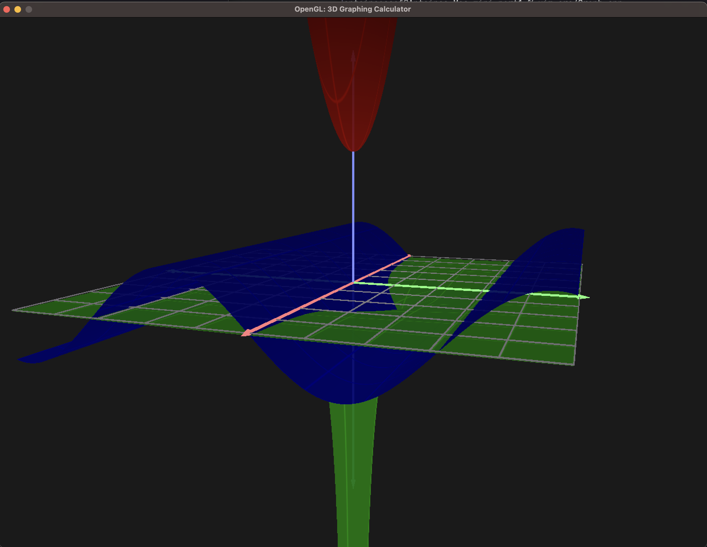
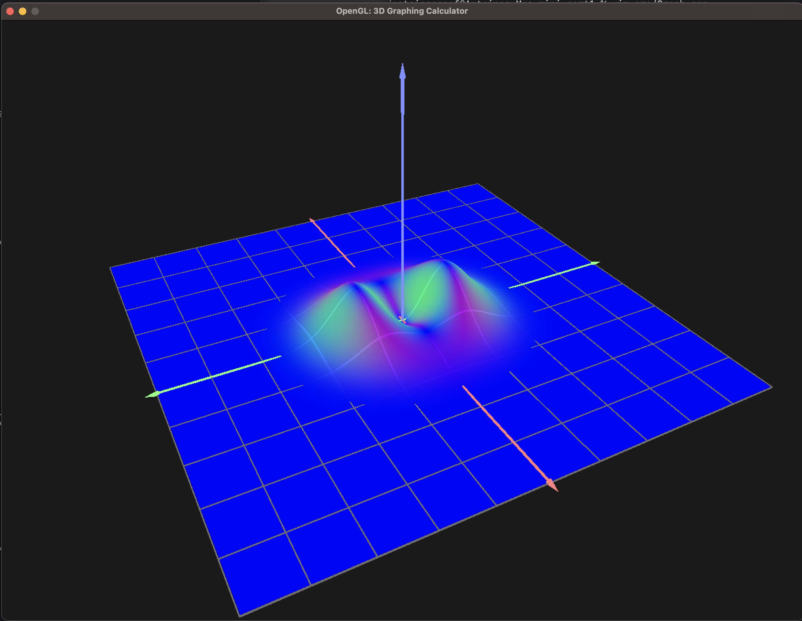
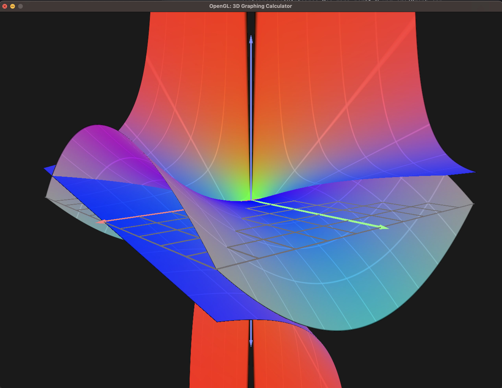
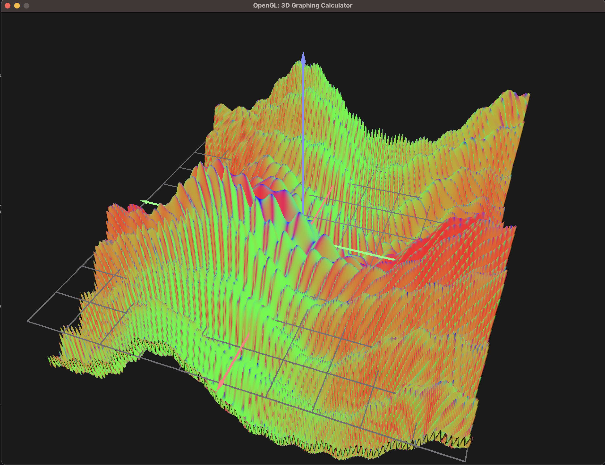

# 3D GRAPHING CALCULATOR C++
### Antoine Assaf 2023

### YouTube [Video](https://youtu.be/RymplOlUg_c)

### Instructions
In the CLI, enter up to 3 equations in terms of variables x and y. (note: z axis is UP) 
Example: `./project "x^2 + y^2" "1/(x\*y)"`
will graph equations:
z = x^2 + y^2
z = 1/x\*y

Press N to toggle the normals, H to toggle x-y grid highlights, and use the arrow keys to turn the camera

PPM height map images of graphs can be found in `./generated/`

### Screenshots

 

